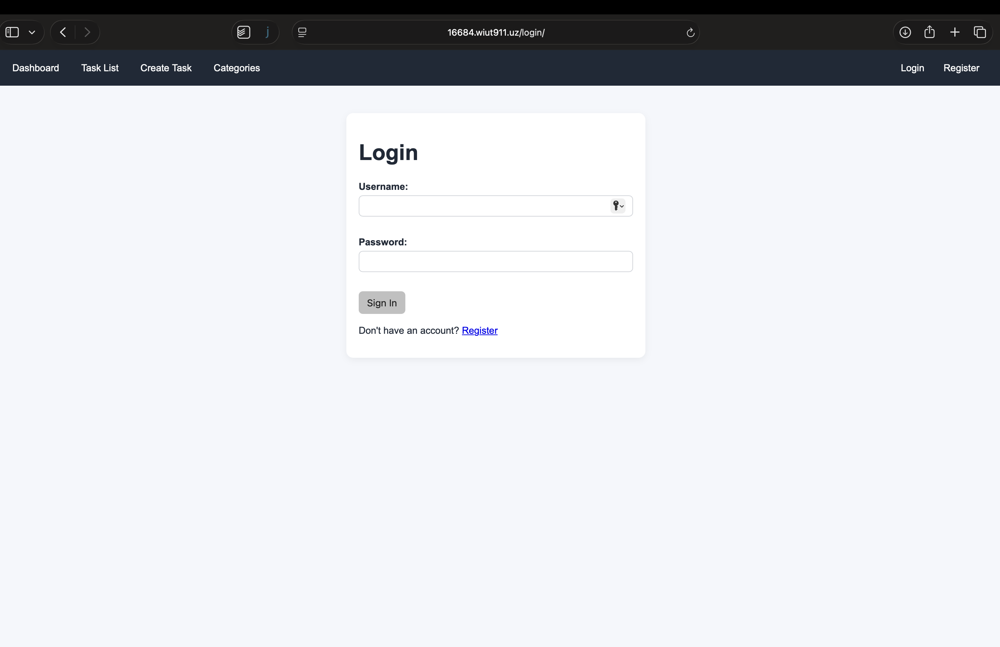
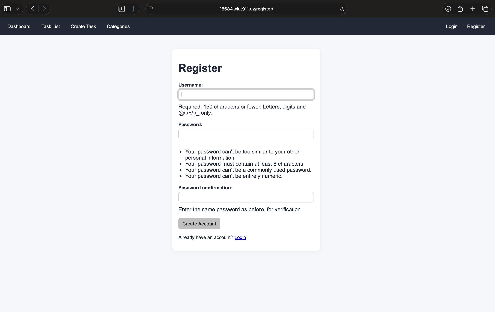
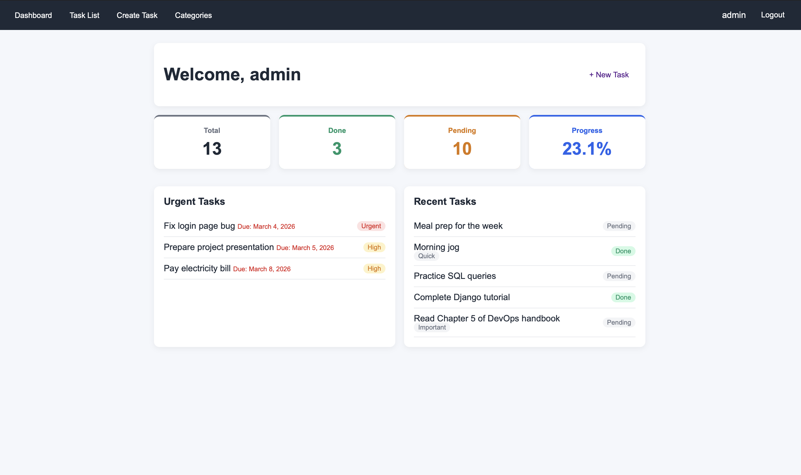
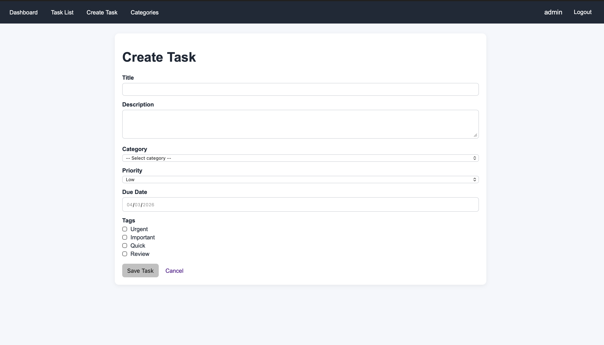
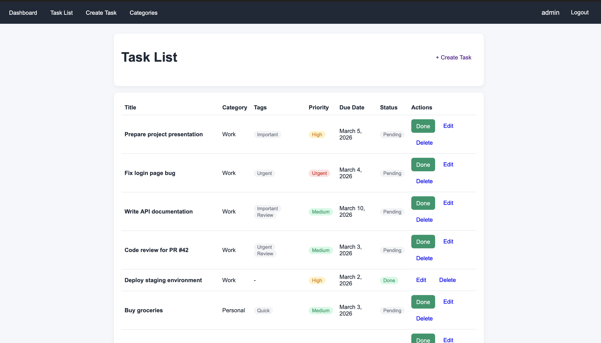
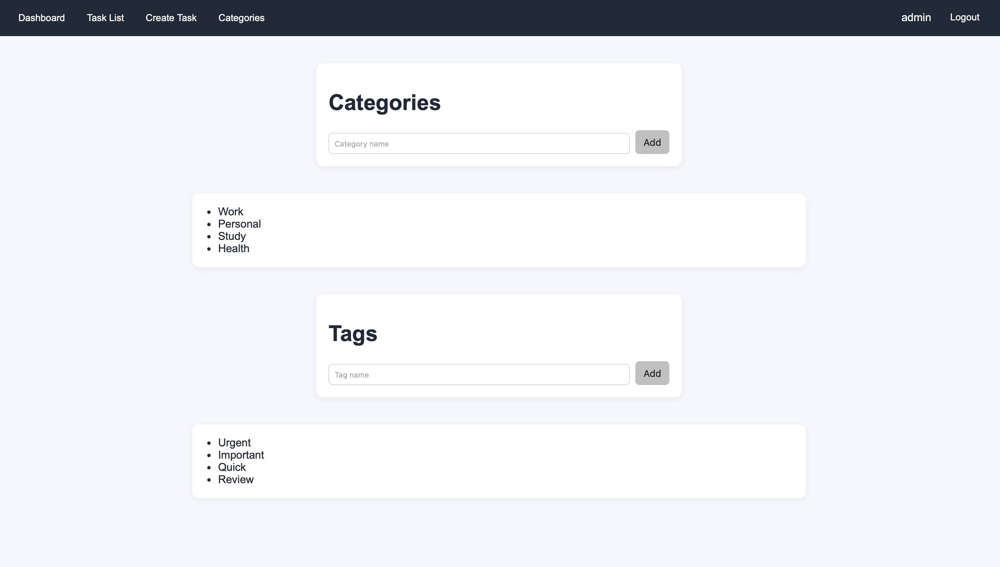

# ToDoList

A full-featured task management web application built with Django. Users can create, organize, and track tasks with categories, tags, priorities, subtasks, and due dates. Includes an analytics dashboard for task insights.

## Features

- User registration and authentication
- Create, edit, and delete tasks
- Task priority levels (Low, Medium, High, Urgent)
- Categories and tags for task organization
- Subtasks for breaking down work
- Due date tracking
- Mark tasks as completed
- Dashboard with task statistics and urgent/recent tasks
- Analytics page with breakdowns by priority, category, and tag
- Responsive UI

## Technologies Used

- **Backend:** Django 6.0.2, Python 3.13
- **Database:** PostgreSQL 16 (SQLite for CI testing)
- **Web Server:** Gunicorn + Nginx reverse proxy
- **Cache:** Redis 7
- **Containerization:** Docker, Docker Compose
- **CI/CD:** GitHub Actions
- **Image Registry:** Docker Hub
- **Hosting:** Azure VM (Ubuntu 24.04)

## Local Setup

### Prerequisites

- Python 3.12+
- PostgreSQL (or use SQLite by setting `CI=true`)

### Installation

1. Clone the repository:
   ```bash
   git clone https://github.com/qobiljons/ToDoListCICD.git
   cd ToDoListCICD
   ```

2. Create and activate a virtual environment:
   ```bash
   python -m venv venv
   source venv/bin/activate
   ```

3. Install dependencies:
   ```bash
   pip install -r requirements.txt
   ```

4. Create a `.env` file in the project root:
   ```bash
   cp .env.example .env
   ```
   See [Environment Variables](#environment-variables) for details.

5. Run migrations:
   ```bash
   python manage.py migrate
   ```

6. Create a superuser (optional):
   ```bash
   python manage.py createsuperuser
   ```

7. Run the development server:
   ```bash
   python manage.py runserver
   ```

8. Open http://127.0.0.1:8000 in your browser.

### Running Tests

```bash
CI=true pytest -v
```

### Linting

```bash
flake8 .
```

## Deployment

The project uses a CI/CD pipeline with GitHub Actions. Every push to `main` triggers:

1. **Lint** - Runs `flake8`
2. **Test** - Runs `pytest`
3. **Build** - Builds Docker image and pushes to Docker Hub
4. **Deploy** - Copies config files to server, pulls the new image, and restarts services

### Manual Deployment with Docker Compose

1. SSH into the server:
   ```bash
   ssh azureuser@<server-ip>
   ```

2. Ensure Docker and Docker Compose are installed.

3. Create a `.env` file in the project directory (see [Environment Variables](#environment-variables)).

4. Start the services:
   ```bash
   docker compose pull
   docker compose up -d
   docker compose exec -T web python manage.py migrate --noinput
   docker compose exec -T web python manage.py collectstatic --noinput
   ```

### Services

| Service | Image | Port |
|---------|-------|------|
| Django (Gunicorn) | `itsqobiljon/todolist:latest` | 8000 (internal) |
| PostgreSQL | `postgres:16-alpine` | 5432 (internal) |
| Nginx | `nginx:alpine` | 80 (public) |
| Redis | `redis:7-alpine` | 6379 (internal) |

## Environment Variables

Create a `.env` file in the project root with the following variables:

| Variable | Description | Example |
|----------|-------------|---------|
| `SECRET_KEY` | Django secret key | `django-insecure-your-secret-key` |
| `DEBUG` | Enable debug mode | `True` or `False` |
| `ALLOWED_HOSTS` | Comma-separated allowed hosts | `localhost,127.0.0.1` |
| `DB_NAME` | PostgreSQL database name | `todo_db` |
| `DB_USER` | PostgreSQL username | `postgres` |
| `DB_PASSWORD` | PostgreSQL password | `strongpassword` |
| `DB_HOST` | Database host (`db` for Docker) | `db` |
| `DB_PORT` | Database port | `5432` |

### GitHub Secrets (for CI/CD)

| Secret | Description |
|--------|-------------|
| `DOCKERHUB_USERNAME` | Docker Hub username |
| `DOCKERHUB_TOKEN` | Docker Hub access token |
| `SSH_HOST` | Server IP address |
| `SSH_USERNAME` | SSH username |
| `SSH_PRIVATE_KEY` | SSH private key for server access |

## Screenshots

<!-- Add your screenshots below -->












